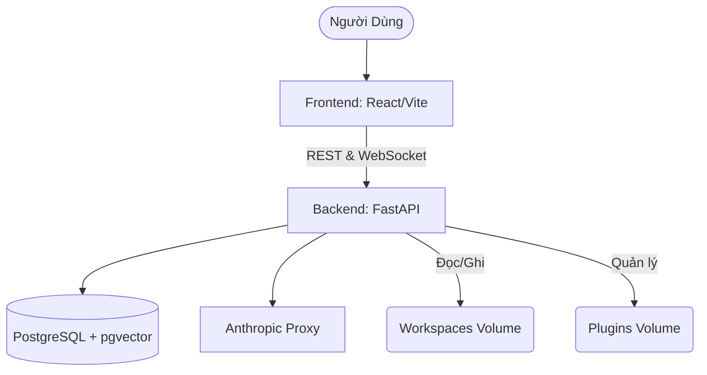

# Masuzu - Claude Agent Platform 

Masuzu là một nền tảng trợ lý AI (Agent Platform) nội bộ cực kỳ mạnh mẽ, được xây dựng dựa trên cốt lõi là **Claude (Anthropic)** và **9router**. Hệ thống này không chỉ đơn thuần là một giao diện chat, mà đóng vai trò như một **Agentic IDE** hoàn chỉnh, cho phép AI tự động phân tích, lập kế hoạch, chỉnh sửa code và quản lý tệp tin một cách độc lập thông qua cấu trúc Workspace cách ly.

Link 9router : https://github.com/decolua/9router

Link claude-code : https://github.com/anthropics/claude-code

---

## Các Tính Năng Cốt Lõi (Core Features)

### 1. Giao Diện Streaming Tốc Độ Cao (Real-time Streaming UI)
- Trải nghiệm mượt mà không độ trễ nhờ kết nối **WebSocket**.
- Tiến trình suy nghĩ của Agent, các bước chạy Tool (công cụ), cũng như nội dung output được hiển thị tức thì (stream) lên màn hình mà không cần chờ tải lại trang.
- Cơ chế buffering và batch update giúp giao diện ổn định ngay cả khi AI trả về lượng dữ liệu khổng lồ.

### 2. Quản Lý Không Gian Làm Việc Độc Lập (Isolated Workspaces)
- Mỗi "Session" (phiên làm việc) tương ứng với một **Workspace** (thư mục vật lý riêng biệt) bên trong container.
- Claude Agent có toàn quyền đọc, ghi, tạo mới hoặc xóa file trong Workspace này mà không ảnh hưởng đến hệ thống gốc hay các dự án khác.
- Lịch sử chat và trạng thái hệ thống được lưu vĩnh viễn trong cơ sở dữ liệu **PostgreSQL**.

### 3. Hệ Thống Plugin Động (Dynamic Plugin System)
- Khả năng mở rộng không giới hạn thông qua **Plugins**. Hệ thống tự động quét và nhận diện các plugin tích hợp sẵn (builtin) và plugin do người dùng tải lên (imported).
- Mỗi Plugin tuân theo chuẩn cấu trúc: có file `.claude-plugin/plugin.json`, chứa định nghĩa các **Commands, Agents, Skills, Hooks** và hỗ trợ **MCP (Model Context Protocol)**.
- Người dùng có thể bật/tắt plugin cho từng Session riêng biệt. Khi được bật, mã nguồn của plugin sẽ được copy trực tiếp vào thư mục `.claude/plugins` của Workspace, giúp Agent tự động nhận dạng công cụ mới.

### 4. Lệnh Điều Khiển Gạch Chéo (Slash Commands)
- Cho phép người dùng ra lệnh điều hướng nhanh cho Agent ngay trên thanh chat. Hỗ trợ Autocomplete (gợi ý tự động).
- Ví dụ các lệnh cơ bản:
  - `/goal <nội dung>`: Giao phó một mục tiêu dài hạn để Agent tự lập kế hoạch và thực thi.
  - `/loop`: Yêu cầu Agent lặp lại tác vụ hoặc tự động sửa lỗi cho đến khi thành công.
  - Ngoài ra, các plugin cũng có thể cung cấp thêm các Slash Commands tùy chỉnh (ví dụ: `/build`, `/deploy`).

### 5. Tích hợp Semantic Search & File Preview
- **Semantic Search**: Sử dụng **pgvector** trong PostgreSQL để nhúng (embed) các đoạn chat. Giúp Agent dễ dàng tìm kiếm lại ngữ cảnh, lịch sử trò chuyện cũ với độ chính xác cao.
- **File Preview Sidebar**: Khi Agent tạo ra một bản kế hoạch hoặc chỉnh sửa file, tên file sẽ xuất hiện dưới dạng một liên kết (Chip). Bấm vào đó, nội dung file sẽ được hiển thị ngay tại thanh bên phải (Sidebar) của UI.

---

## Kiến Trúc Hệ Thống (Architecture)

Masuzu được xây dựng theo mô hình Microservices chạy hoàn toàn trong Docker.



1. **Frontend (`/frontend`)**: Được viết bằng **React 18, Vite, Zustand, Tailwind CSS**. Sử dụng `reconnecting-websocket` để duy trì kết nối ổn định.
2. **Backend (`/backend`)**: Viết bằng **Python FastAPI**. Tích hợp **SQLAlchemy & AsyncPG** cho tốc độ truy xuất database cực nhanh. Quản lý việc thực thi `claude-code` (CLI runner của Agent).
3. **Database (`postgres`)**: Dùng hình ảnh `pgvector/pgvector:pg16` để hỗ trợ lưu trữ Vector Embeddings, phục vụ tính năng trí nhớ của Agent.
4. **Proxy & Router**: Định tuyến các truy vấn API ra ngoài (Anthropic API) thông qua proxy nội bộ nhằm đảm bảo an mật và vượt rào cản mạng.

---

## Hướng Dẫn Cài Đặt (Installation Guide)

### Yêu Cầu
- Hệ điều hành: Windows, macOS, hoặc Linux.
- **Docker Desktop** (hoặc Docker Engine & Docker Compose).
- API Key của Anthropic (Nên cấu hình sẵn trong `.env` nếu cần, hoặc hệ thống proxy đã lo phần auth token).

### Bước 1: Khởi động hệ thống
Mở terminal, trỏ tới thư mục gốc dự án (`Masuzu`) và chạy lệnh:
```bash
docker-compose up --build -d
```
Hệ thống sẽ tải image và build các service. Lần đầu tiên chạy có thể mất từ 3-5 phút.

### Bước 2: Kiểm tra trạng thái
Kiểm tra xem các container đã chạy ổn định chưa bằng lệnh:
```bash
docker-compose ps
```

### Bước 3: Truy Cập
- **Ứng dụng Web**: Mở trình duyệt và vào [http://localhost:3000](http://localhost:3000)
- **Tài liệu API (Backend Swagger UI)**: Truy cập [http://localhost:8001/docs](http://localhost:8001/docs)

---

## Hướng Dẫn Sử Dụng Chi Tiết (User Guide)

### 1. Khởi tạo một Session (Phiên làm việc mới)
- Ở thanh sidebar bên trái của giao diện, nhấn nút **"New Session"** hoặc biểu tượng dấu `+`.
- Nhập tên Project (Dự án). Ví dụ: `my-react-app`.
- Hệ thống sẽ cấp một ID, thiết lập thư mục riêng tại `/workspaces/<session_id>` và chọn mặc định mô hình AI.

### 2. Tương tác với AI
- Nhập yêu cầu vào ô chat. Nếu bạn muốn agent làm việc gì đó phức tạp, hãy dùng lệnh `/goal Tạo một trang web bán hàng cơ bản với HTML, CSS và JS`.
- Sau khi gửi, trạng thái sẽ chuyển thành `RUNNING`. Bạn sẽ thấy AI bắt đầu dùng các Tool (như `bash`, `str_replace`, `write_file`...) để tự động gõ code. Bạn không cần can thiệp trừ khi AI hỏi (Ask User).

### 3. Cài đặt Plugin (Góc cho Developer)
Nếu bạn muốn dạy Claude các kỹ năng mới cho dự án hiện tại:
1. Bạn có thể Upload một file `.zip` hoặc folder plugin trực tiếp qua giao diện.
2. Hoặc chép thư mục plugin vào `d:\Masuzu\plugins\`. Cấu trúc thư mục tối thiểu của plugin:
```text
my-plugin/
 ├── .claude-plugin/
 │    └── plugin.json     <-- Khai báo tên, mô tả, phiên bản.
 ├── commands/            <-- Các bash script hoặc file thực thi
 ├── skills/              <-- Các logic nội bộ
 └── README.md            <-- Tài liệu hướng dẫn sử dụng plugin
```
3. Vào Session tương ứng, click tab **Plugins** và nhấn **Activate** (Kích hoạt).

### 4. Xử Lý Sự Cố (Troubleshooting)
- **Giao diện cứ xoay vòng / Lỗi WebSocket**: Kiểm tra backend bằng lệnh `docker-compose logs -f backend`.
- **Database báo lỗi thiếu relation**: Hãy chắc chắn hệ thống Lifespan của FastAPI đã chạy hàm `init_db()` khi startup. Bạn có thể khởi động lại backend: `docker-compose restart backend`.

---

> **Lưu ý Quan Trọng**: Không nên xóa thủ công thư mục trong `workspaces/` từ bên ngoài máy host khi Session vẫn đang `running`. Hãy xóa thông qua giao diện Web để DB và ổ cứng đồng bộ!